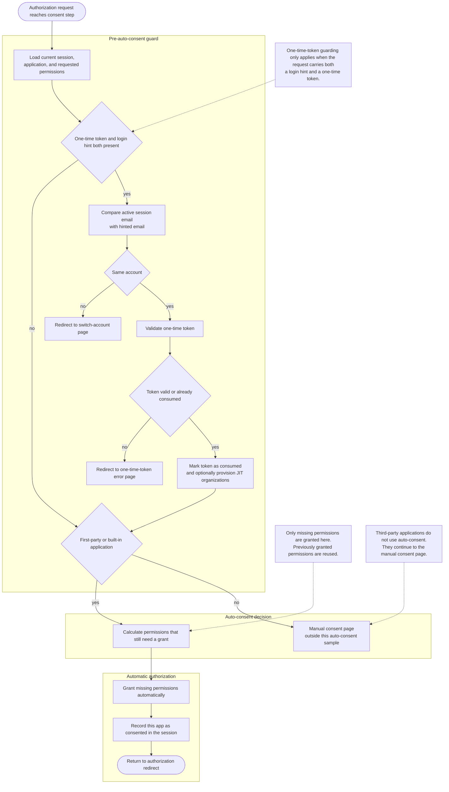

# Auto-consent flow

```mermaid
flowchart TD
  start([Authorization request reaches consent step])
  start --> ctx0[Load current session,<br/>application, and requested permissions]

  subgraph Guard["Pre-auto-consent guard"]
    ctx0 --> guard0{One-time token and login hint both present}
    guard0 -->|no| app_check
    guard0 -->|yes| guard1[Compare active session email<br/>with hinted email]
    guard1 --> guard2{Same account}
    guard2 -->|no| switch_account[Redirect to switch-account page]
    guard2 -->|yes| guard3[Validate one-time token]
    guard3 --> guard4{Token valid or already consumed}
    guard4 -->|no| token_error[Redirect to one-time-token error page]
    guard4 -->|yes| guard5[Mark token as consumed<br/>and optionally provision JIT organizations]
  end

  guard5 --> app_check

  subgraph Decision["Auto-consent decision"]
    app_check{First-party or built-in application}
    app_check -->|yes| scope_check[Calculate permissions that still need a grant]
    app_check -->|no| manual[Manual consent page<br/>outside this auto-consent sample]
  end

  subgraph AutoConsent["Automatic authorization"]
    scope_check --> grant[Grant missing permissions automatically]
    grant --> session_mark[Record this app as consented in the session]
    session_mark --> redirect([Return to authorization redirect])
  end

  note_scope[Only missing permissions are granted here.<br/>Previously granted permissions are reused.]
  note_third_party[Third-party applications do not use auto-consent.<br/>They continue to the manual consent page.]
  note_token[One-time-token guarding only applies when the request carries both<br/>a login hint and a one-time token.]

  note_scope -.-> scope_check
  note_third_party -.-> manual
  note_token -.-> guard0
```
