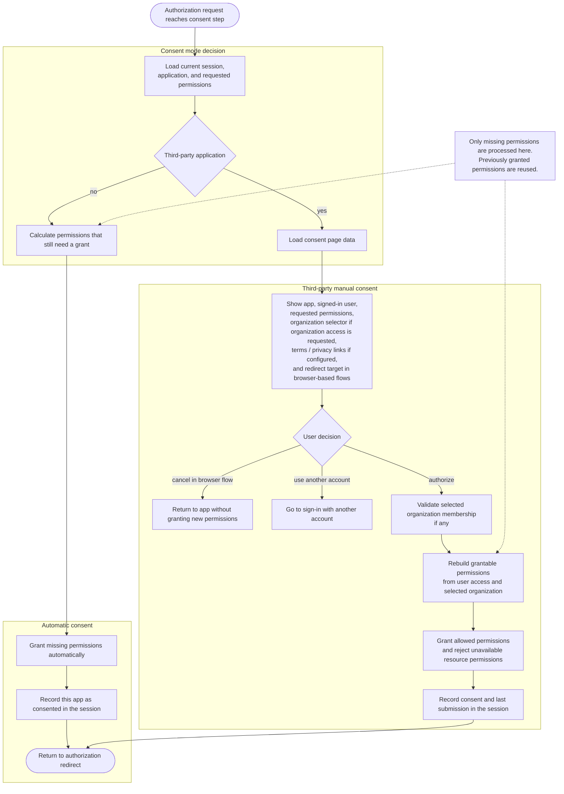

# Consent flow

```mermaid
flowchart TD
  start([Authorization request reaches consent step])
  start --> ctx0[Load current session,<br/>application, and requested permissions]

  subgraph Decision["Consent mode decision"]
    ctx0 --> app_check{Third-party application}
    app_check -->|no| auto_scope[Calculate permissions that still need a grant]
    app_check -->|yes| manual_load[Load consent page data]
  end

  subgraph AutoConsent["Automatic consent"]
    auto_scope --> auto_grant[Grant missing permissions automatically]
    auto_grant --> auto_record[Record this app as consented in the session]
    auto_record --> done([Return to authorization redirect])
  end

  subgraph ManualConsent["Third-party manual consent"]
    manual_load --> manual_page[Show app, signed-in user,<br/>requested permissions,<br/>organization selector if organization access is requested,<br/>terms / privacy links if configured,<br/>and redirect target in browser-based flows]
    manual_page --> consent_decision{User decision}

    consent_decision -->|cancel in browser flow| cancel[Return to app without granting new permissions]
    consent_decision -->|use another account| reauth[Go to sign-in with another account]
    consent_decision -->|authorize| org_validate[Validate selected organization membership<br/>if any]

    org_validate --> scope_rebuild[Rebuild grantable permissions<br/>from user access and selected organization]
    scope_rebuild --> manual_grant[Grant allowed permissions<br/>and reject unavailable resource permissions]
    manual_grant --> manual_record[Record consent and last submission in the session]
    manual_record --> done
  end

  note_missing[Only missing permissions are processed here.<br/>Previously granted permissions are reused.]

  note_missing -.-> auto_scope
  note_missing -.-> scope_rebuild
```
