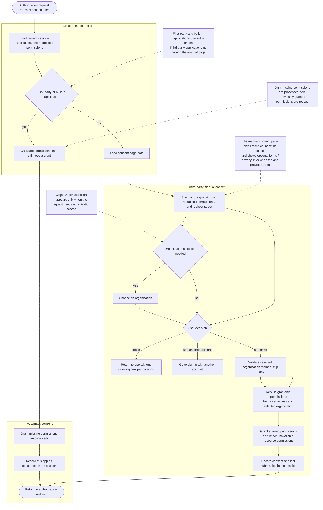

# Consent flow

```mermaid
flowchart TD
  start([Authorization request reaches consent step])
  start --> ctx0[Load current session,<br/>application, and requested permissions]

  subgraph Decision["Consent mode decision"]
    ctx0 --> app_check{First-party or built-in application}
    app_check -->|yes| auto_scope[Calculate permissions that still need a grant]
    app_check -->|no| manual_load[Load consent page data]
  end

  subgraph AutoConsent["Automatic consent"]
    auto_scope --> auto_grant[Grant missing permissions automatically]
    auto_grant --> auto_record[Record this app as consented in the session]
    auto_record --> done([Return to authorization redirect])
  end

  subgraph ManualConsent["Third-party manual consent"]
    manual_load --> manual_page[Show app, signed-in user,<br/>requested permissions, and redirect target]
    manual_page --> org_gate{Organization selection needed}
    org_gate -->|yes| org_select[Choose an organization]
    org_gate -->|no| consent_decision
    org_select --> consent_decision{User decision}

    manual_page --> consent_decision
    consent_decision -->|cancel| cancel[Return to app without granting new permissions]
    consent_decision -->|use another account| reauth[Go to sign-in with another account]
    consent_decision -->|authorize| org_validate[Validate selected organization membership<br/>if any]

    org_validate --> scope_rebuild[Rebuild grantable permissions<br/>from user access and selected organization]
    scope_rebuild --> manual_grant[Grant allowed permissions<br/>and reject unavailable resource permissions]
    manual_grant --> manual_record[Record consent and last submission in the session]
    manual_record --> done
  end

  note_missing[Only missing permissions are processed here.<br/>Previously granted permissions are reused.]
  note_page[The manual consent page hides technical baseline scopes<br/>and shows optional terms / privacy links when the app provides them.]
  note_org[Organization selection appears only when the request needs organization access.]
  note_auto[First-party and built-in applications use auto-consent.<br/>Third-party applications go through the manual page.]

  note_missing -.-> auto_scope
  note_missing -.-> scope_rebuild
  note_page -.-> manual_page
  note_org -.-> org_gate
  note_auto -.-> app_check
```
