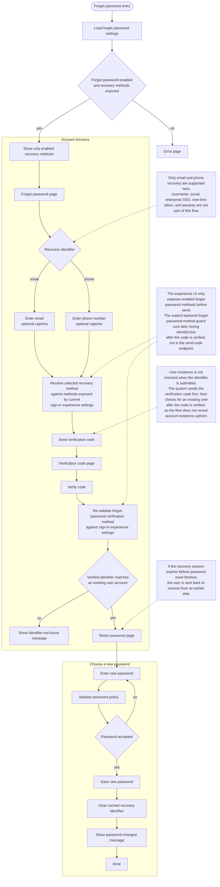

# Forgot password flow

```mermaid
flowchart TD
  start([Forgot password entry])
  start --> fp_settings[Load forgot password settings]
  fp_settings --> fp_enabled{Forgot password enabled<br/>and recovery methods exposed}
  fp_enabled -->|no| fp_error[Error page]
  fp_enabled -->|yes| fp_methods[Show only enabled recovery methods]

  subgraph Recovery["Account recovery"]
    fp_methods --> fp0[Forgot password page]
    fp0 --> fp1{Recovery identifier}
    fp1 -->|email| fp2[Enter email<br/>optional captcha]
    fp1 -->|phone| fp3[Enter phone number<br/>optional captcha]

    fp2 --> fp_method_ui[Resolve selected recovery method<br/>against methods exposed by current<br/>sign-in experience settings]
    fp3 --> fp_method_ui
    fp_method_ui --> send_code[Send verification code]
    send_code --> code_page[Verification code page]
    code_page --> verify[Verify code]
    verify --> fp_method_backend[Re-validate forgot-password verification method<br/>against sign-in experience settings]
    fp_method_backend --> found
    found{Verified identifier matches<br/>an existing user account}
    found -->|no| no_user[Show identifier-not-found message]
    found -->|yes| reset0[Reset password page]
  end

  subgraph ResetPassword["Choose a new password"]
    reset0 --> reset1[Enter new password]
    reset1 --> reset2[Validate password policy]
    reset2 --> reset3{Password accepted}
    reset3 -->|no| reset1
    reset3 -->|yes| reset4[Save new password]
    reset4 --> reset5[Clear cached recovery identifier]
    reset5 --> success[Show password-changed message]
    success --> done
  end

  note_methods[Only email and phone recovery are supported here.<br/>Username, social, enterprise SSO, one-time token, and passkey are not part of this flow.]
  note_existence[User existence is not checked when the identifier is submitted.<br/>The system sends the verification code first, then checks for an existing user<br/>after the code is verified, so the flow does not reveal account existence upfront.]
  note_session[If the recovery session expires before password reset finishes,<br/>the user is sent back to resume from an earlier step.]
  note_guard[The experience UI only exposes enabled forgot-password methods before send.<br/>The explicit backend forgot-password-method guard runs later during identifyUser,<br/>after the code is verified, not in the send-code endpoint.]

  note_methods -.-> fp1
  note_existence -.-> send_code
  note_session -.-> reset0
  note_guard -.-> fp_method_ui
  note_guard -.-> fp_method_backend
```
