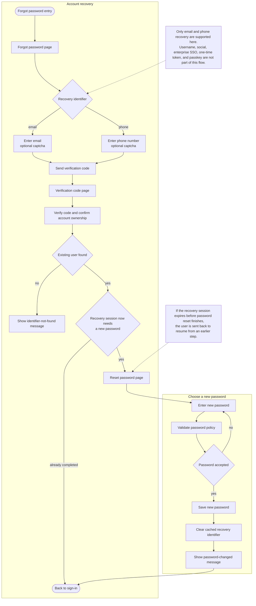

# Forgot password flow

```mermaid
flowchart TD
  start([Forgot password entry])

  subgraph Recovery["Account recovery"]
    start --> fp0[Forgot password page]
    fp0 --> fp1{Recovery identifier}
    fp1 -->|email| fp2[Enter email<br/>optional captcha]
    fp1 -->|phone| fp3[Enter phone number<br/>optional captcha]

    fp2 --> send_code[Send verification code]
    fp3 --> send_code
    send_code --> code_page[Verification code page]
    code_page --> verify[Verify code and confirm account ownership]
    verify --> found{Existing user found}
    found -->|no| no_user[Show identifier-not-found message]
    found -->|yes| reset_gate{Recovery session now needs<br/>a new password}
    reset_gate -->|yes| reset0[Reset password page]
    reset_gate -->|already completed| done([Back to sign-in])
  end

  subgraph ResetPassword["Choose a new password"]
    reset0 --> reset1[Enter new password]
    reset1 --> reset2[Validate password policy]
    reset2 --> reset3{Password accepted}
    reset3 -->|no| reset1
    reset3 -->|yes| reset4[Save new password]
    reset4 --> reset5[Clear cached recovery identifier]
    reset5 --> success[Show password-changed message]
    success --> done
  end

  note_methods[Only email and phone recovery are supported here.<br/>Username, social, enterprise SSO, one-time token, and passkey are not part of this flow.]
  note_session[If the recovery session expires before password reset finishes,<br/>the user is sent back to resume from an earlier step.]

  note_methods -.-> fp1
  note_session -.-> reset0
```
