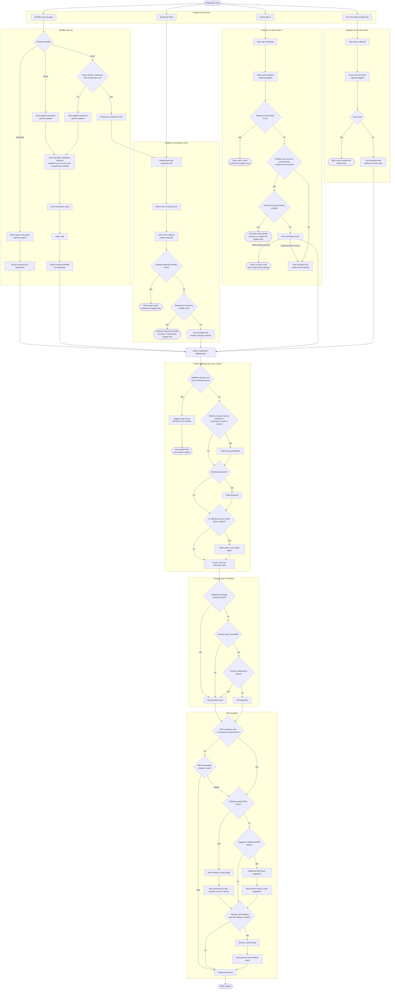

# Register flow

```mermaid
flowchart TD
  start([Registration entry])

  subgraph EntryPoints["Register entry points"]
    id0[Identifier sign-up page]
    sso0[Enterprise SSO]
    so0[Social sign-in]
    ml0["One-time token (magic link)"]
  end

  start --> id0
  start --> sso0
  start --> so0
  start --> ml0

  subgraph Identifier["Identifier sign-up"]
    id0 --> id1{Primary identifier}
    id1 -->|username| idu1[Start register interaction<br/>optional captcha]
    idu1 --> idu2[Submit username for registration]

    id1 -->|phone| idv1[Start register interaction<br/>optional captcha]
    idv1 --> id_method_ui

    id1 -->|email| ide1{Check whether enterprise SSO should take over}
    ide1 -->|yes| sso_redirect[Redirect to enterprise SSO]
    ide1 -->|no| ide2[Start register interaction<br/>optional captcha]

    ide2 --> id_method_ui[Show identifier verification methods<br/>enabled by the current sign-in experience settings]
    id_method_ui --> idv2[Send verification code]
    idv2 --> idv3[Verify code]
    idv3 --> reg_verified[Submit verified identifier<br/>for registration]
  end

  subgraph EnterpriseSSO["Register via enterprise SSO"]
    sso_redirect --> sso1[Authenticate with enterprise IdP]
    sso0 --> sso1
    sso1 --> sso2[Return from enterprise IdP]
    sso2 --> sso2b[Verify SSO callback<br/>captcha skipped]
    sso2b --> sso3{Existing enterprise identity found}
    sso3 -->|yes| out_sso([Direct sign-in path<br/>outside this register flow])
    sso3 -->|no| sso4{Related user found by<br/>verified email}
    sso4 -->|yes| out_sso_link([Auto-link enterprise identity<br/>and sign in outside this register flow])
    sso4 -->|no| sso5[User identified with<br/>verified enterprise identity]
  end

  subgraph Social["Register via social sign-in"]
    so0 --> so1[Start sign-in attempt]
    so1 --> so2[Verify social callback<br/>captcha skipped]
    so2 --> so2b{Existing social identity found}
    so2b -->|yes| out_social_existing([Direct sign-in path<br/>outside this register flow])
    so2b -->|no| so3{Related user found by social identity,<br/>verified email or phone}
    so3 -->|yes| so4{Automatic account linking enabled}
    so4 -->|yes| out_social_auto_link([Auto-link social identity<br/>and sign in outside this register flow])
    so4 -->|no| so5[Account-linking choice]
    so5 -->|Bind existing account| out_social_sign_in([Switch to sign-in flow<br/>with verified social identity])
    so5 -->|Create another account| so6[User identified with<br/>verified social identity]
    so3 -->|no| so6
  end

  subgraph MagicLink["Register via one-time token"]
    ml0 --> ml1[Start sign-in attempt]
    ml1 --> ml2[Verify one-time token<br/>captcha skipped]
    ml2 --> ml3{User exists}
    ml3 -->|yes| out_ml([Sign-in path outside this register flow])
    ml3 -->|no| ml4[User identified with<br/>verified one-time token]
  end

  subgraph RegisterBackend["Profile fulfillment and user creation"]
    existing_id -->|yes| out_existing_id[Suggest sign-in flow<br/>with the same identifier]
    out_existing_id --> out_existing_id_done([Exit register flow<br/>and restart in sign-in])
    existing_id -->|no| missing_required_identifier{"Missing required sign-up identifiers?<br/>(Username, email, or phone)"}

    missing_required_identifier -->|no| required_password{Required password?}
    missing_required_identifier -->|yes| fulfill_missing_identifiers[Fulfill missing identifiers]

    fulfill_missing_identifiers --> required_password
    required_password -->|yes| fulfill_password[Fulfill password]
    required_password -->|no| collect_custom_profile_enabled{Is collecting custom profile fields enabled?}
    fulfill_password -->  collect_custom_profile_enabled

    collect_custom_profile_enabled -->|yes| collect_custom_profile[Fulfill custom user profile fields]
    collect_custom_profile_enabled -->|no| create_user[Create user from interaction data]
    collect_custom_profile --> create_user
  end

  reg_attempt[Submit registration identification]
  idu2 --> reg_attempt
  reg_verified --> reg_attempt
  sso5 --> reg_attempt
  so5 --> reg_attempt
  ml4 --> reg_attempt

  reg_attempt --> existing_id{Identifier already used<br/>by an existing account}

  subgraph PasskeyBinding["Passkey sign-in handling"]
    create_user --> sso_bypass{Registered through enterprise SSO?}
    sso_bypass -->|yes| skip_passkey
    sso_bypass -->|no| passkey_enabled{Passkey sign-in enabled?}

    passkey_enabled -->|no| skip_passkey
    passkey_enabled -->|yes| passkey_bound{"Passkey (WebAuthn) bound?"}

    passkey_bound -->|yes| skip_passkey
    passkey_bound -->|no| bind_passkey[Bind passkey]
  end

  subgraph MfaFlow["MFA handling"]
    skip_passkey[Skip passkey setup] --> mfa_policy
    bind_passkey --> mfa_policy

    mfa_policy{MFA mandatory now<br/>or required by organization?}
    mfa_policy -->|no| mfa_onboarding{MFA onboarding:<br/>Enable or skip?}

    mfa_onboarding -->|skip| submit
    mfa_onboarding -->|enable| mfa_missing

    mfa_policy -->|yes| mfa_missing

    mfa_missing{Missing required MFA factor?}
    mfa_missing -->|yes| mfa_bind[MFA binding or factor page]
    mfa_missing -->|no| mfa_suggestion{Suggest an additional MFA factor?}

    mfa_bind --> mfa_bind2[Bind authenticator app, passkey, email, or phone]
    mfa_bind2 --> backup_gate

    mfa_suggestion -->|yes| mfa_suggestion_bind[Additional MFA factor suggestion]
    mfa_suggestion -->|no| backup_gate{Backup code enabled<br/>and still missing or empty?}

    mfa_suggestion_bind --> mfa_suggestion_bind2[Bind another factor or skip suggestion]
    mfa_suggestion_bind2 --> backup_gate

    backup_gate -->|yes| backup[Backup code binding]
    backup_gate -->|no| submit[Submit interaction]

    backup --> backup2[Generate and save backup codes]
    backup2 --> submit
  end

  submit --> done([OIDC redirect])
```
