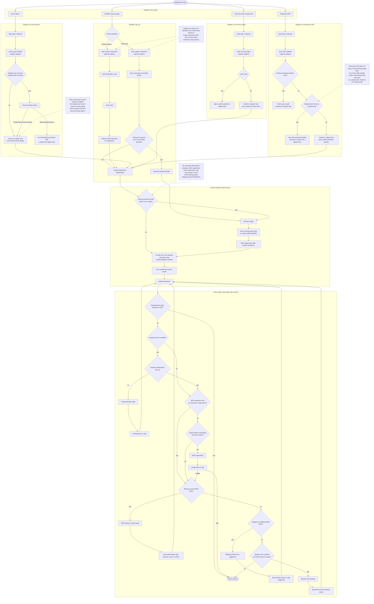

# Register flow

```mermaid
flowchart TD
  start([Registration entry])

  subgraph EntryPoints["Register entry points"]
    id0[Identifier sign-up page]
    so0[Social sign-in]
    ml0["One-time token (magic link)"]
    sso0[Enterprise SSO]
  end

  start --> id0
  start --> so0
  start --> ml0
  start --> sso0

  subgraph Identifier["Identifier sign-up"]
    id0 --> id1{Primary identifier}
    id1 -->|username| idu1[Start register interaction<br/>optional captcha]
    idu1 --> idu2[Save username to pending profile]
    idu2 --> idu3{Password required<br/>and no secondary identifiers}
    idu3 -->|yes| cont_pw[Continue password page]
    idu3 -->|no| reg_attempt

    id1 -->|email or phone| idv1[Start register interaction<br/>optional captcha]
    idv1 --> idv2[send verification code]
    idv2 --> idv3[verify code]
    idv3 --> reg_verified[Submit verified identifier<br/>for registration]
  end

  cont_pw --> continue_flow
  reg_verified --> reg_attempt

  subgraph Social["Register via social sign-in"]
    so0 --> so1[Start sign-in attempt]
    so1 --> so2[verify social callback<br/>captcha skipped]
    so2 --> so3{Related user found by<br/>verified email or phone}
    so3 -->|no| so5[Switch to register flow<br/>with verified social identity]
    so3 -->|yes| so4[Account linking choice]
    so4 -->|Bind existing account| out_social_link[Account-linking and sign-in path<br/>outside this register flow]
    so4 -->|Create new account instead| so5
  end

  so5 --> reg_attempt

  subgraph MagicLink["Register via one-time token"]
    ml0 --> ml1[Start sign-in attempt]
    ml1 --> ml2[verify one-time token<br/>captcha skipped]
    ml2 --> ml3{User exists}
    ml3 -->|yes| out_ml[Sign-in path outside this register flow]
    ml3 -->|no| ml4[Switch to register flow<br/>with verified one-time token]
  end

  ml4 --> reg_attempt

  subgraph EnterpriseSSO["Register via enterprise SSO"]
    sso0 --> sso1[Start sign-in attempt]
    sso1 --> sso2[verify SSO callback<br/>captcha skipped]
    sso2 --> sso3{Existing enterprise identity found}
    sso3 -->|yes| out_sso[Direct sign-in path<br/>outside this register flow]
    sso3 -->|no| sso4{Related user found by<br/>verified email}
    sso4 -->|yes| out_sso_link[Auto-link enterprise identity<br/>and sign in outside this register flow]
    sso4 -->|no| sso5[Switch to register flow<br/>with verified enterprise identity]
  end

  sso5 --> reg_attempt

  subgraph RegisterBackend["Shared register backend path"]
    reg_attempt[Submit registration identification]
    reg_attempt --> profile_gate{Missing required profile<br/>before user creation}
    profile_gate -->|yes| continue_flow[Continue pages]
    profile_gate -->|no| create_user[Create user from pending interaction data<br/>verified identifier optional]
    create_user --> created[user created and userId stored]

    continue_flow --> cont1[Save missing profile data<br/>or newly verified identifier]
    cont1 --> cont2[Retry registration after profile completion]
    cont2 --> create_user

    created --> submit[Submit interaction]
  end

  note_profile[No missing-profile gate for enterprise SSO registration.<br/>Social registration may also bypass it when<br/>tenant settings allow skipping required identifiers.]
  note_captcha[Captcha is enforced on identifier entry when policy requires it.<br/>Social, enterprise SSO, and one-time token verification skip captcha.]
  note_social_link[When automatic account linking is enabled,<br/>the related-user branch skips the choice page<br/>and proceeds directly to account-linking sign-in.]
  note_sso_link[Enterprise SSO does not have a manual linking page here.<br/>If no direct SSO identity exists, the backend auto-falls back<br/>to a related user matched by verified email.]

  note_profile -.-> profile_gate
  note_captcha -.-> idu1
  note_captcha -.-> idv1
  note_social_link -.-> so5
  note_sso_link -.-> sso4

  subgraph AfterSubmit["Post-create continuation after submit"]
    submit --> sso_bypass{Registered through enterprise SSO?}
    sso_bypass -->|yes| done([OIDC redirect])
    sso_bypass -->|no| passkey_enabled{Passkey sign-in enabled?}

    passkey_enabled -->|no| mfa_policy
    passkey_enabled -->|yes| passkey_bound{"Passkey (WebAuthn) bound?"}

    passkey_bound -->|yes| mfa_policy
    passkey_bound -->|no| passkey[Create passkey page]

    passkey --> passkey2[bind passkey or skip]
    passkey2 --> submit

    mfa_policy{MFA mandatory now<br/>or required by organization?}
    mfa_policy -->|yes| mfa_missing
    mfa_policy -->|no| mfa_onboarding_needed{Optional MFA onboarding<br/>should be shown?}

    mfa_onboarding_needed -->|yes| mfa_on[MFA onboarding]
    mfa_onboarding_needed -->|no| mfa_missing

    mfa_on --> mfa_on2[enable MFA or skip]
    mfa_on2 -->|skip| done
    mfa_on2 -->|enable| mfa_missing

    mfa_missing{Missing required MFA factor?}
    mfa_missing -->|yes| mfa_bind[MFA binding or factor page]
    mfa_missing -->|no| mfa_suggestion{Suggest an additional MFA factor?}

    mfa_bind --> mfa_bind2[bind authenticator app, passkey, email, or phone]
    mfa_bind2 --> submit

    mfa_suggestion -->|yes| mfa_suggestion_bind[Additional MFA factor suggestion]
    mfa_suggestion -->|no| backup_gate{Backup code enabled<br/>and still missing or empty?}

    mfa_suggestion_bind --> mfa_suggestion_bind2[Bind another factor or skip suggestion]
    mfa_suggestion_bind2 --> submit

    backup_gate -->|yes| backup[Backup code binding]
    backup_gate -->|no| done

    backup --> backup2[generate and save backup codes]
    backup2 --> submit
  end
```
