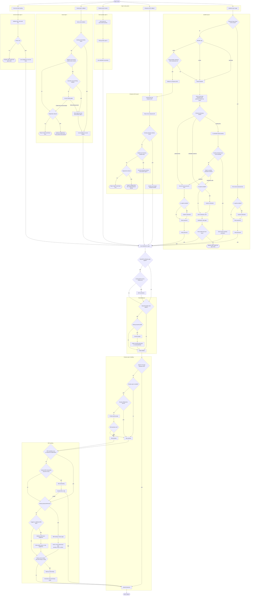

# Sign-in flow

```mermaid
flowchart TD
  start([Sign-in entry])

  subgraph EntryPoints["Sign-in entry points"]
    id0[Identifier sign-in page]
    sso0[Enterprise SSO callback]
    pk0[Passkey sign-in button]
    so0[Social sign-in callback]
    ml0[One-time token landing]
  end

  start --> id0
  start --> sso0
  start --> pk0
  start --> so0
  start --> ml0

  identified[User identified for sign-in]

  subgraph Identifier["Identifier sign-in"]
    id0 --> first_screen_password{Password input shown<br/>on first screen?}

    first_screen_password -->|yes| pw0_first[First screen password form]
    first_screen_password -->|no| id1{Identifier type}

    id1 -->|username| id_submit[Submit identifier]
    id1 -->|phone| id_submit
    id1 -->|email| ide1{Check whether enterprise SSO should take over}
    ide1 -->|no| id_submit
    ide1 -->|yes| sso_redirect[Redirect to enterprise SSO]

    id_submit --> second_step[Enter second-step verification flow<br/>preferred method can switch]
    second_step --> method_priority{Preferred verification method}

    method_priority -->|passkey first| pk_try[Try identifier-based passkey]
    method_priority -->|verification code first| vc_captcha{Is captcha enabled?}
    method_priority -->|password first| pw0_second[Second screen password form]

    vc_captcha -->|yes| vc_captcha_verify[Captcha verification]
    vc_captcha -->|no| vc0[Send verification code]
    vc_captcha_verify --> vc0

    pk_try --> pk_has{Passkey already bound<br/>for this identifier}
    pk_has -->|yes| pk_verify1[Open browser passkey verification]
    pk_has -->|no| method_switch{Switch to another<br/>verification method?}

    method_switch -->|verification code| vc_captcha
    method_switch -->|password| pw0_second

    pw0_first --> pw_captcha_first{Is captcha enabled?}
    pw_captcha_first -->|yes| pw_captcha_first_verify[Captcha verification]
    pw_captcha_first -->|no| pw1_first[Enter password]
    pw_captcha_first_verify --> pw1_first
    pw1_first --> pw2_first[Verify password]

    pw0_second --> pw_captcha_second{Is captcha enabled?}
    pw_captcha_second -->|yes| pw_captcha_second_verify[Captcha verification]
    pw_captcha_second -->|no| pw1_second[Enter password]
    pw_captcha_second_verify --> pw1_second
    pw1_second --> pw2_second[Verify password]

    vc0 --> vc1[Verification code page]
    vc1 --> vc2{Code verified and user found}
    vc2 -->|no| out_vc([Register path outside this sign-in flow])
  end

  subgraph EnterpriseSSO["Enterprise SSO sign-in"]
    sso_redirect --> sso1[Authenticate with enterprise IdP]
    sso0 --> sso1
    sso1 --> sso2[Return from enterprise IdP]
    sso2 --> sso3{Existing enterprise identity found}
    sso3 -->|yes| identified_sso[Identify user through enterprise identity]
    sso3 -->|no| sso4{Related user found by<br/>verified email}
    sso4 -->|yes| identified_sso_linked[Auto-link enterprise identity<br/>and continue sign-in]
    sso4 -->|no| sso5{Registration allowed}
    sso5 -->|yes| out_sso_register([Switch to register flow<br/>with verified enterprise identity])
    sso5 -->|no| out_sso_error([Stay on sign-in and show error])
  end

  subgraph PasskeyDirect["Direct passkey sign-in"]
    pk0 --> pk1[Ask browser for discoverable passkey]
    pk1 --> pk2[Verify passkey sign-in]
    pk2 --> identified_passkey[User identified via passkey]
  end

  subgraph Social["Social sign-in"]
    so0 --> so1[Verify social callback]
    so1 --> so2{Existing social identity found}
    so2 -->|yes| identified_social[User identified via social identity]
    so2 -->|no| so3{Related user found by<br/>verified email or phone}
    so3 -->|yes| so4{Automatic account linking enabled}
    so4 -->|yes| so_linked[Bind related account<br/>and continue sign-in]
    so4 -->|no| so5[Account linking page]
    so5 -->|Bind existing account| so_linked
    so5 -->|Create new account instead| so6{Registration allowed}
    so3 -->|no| so6
    so_linked --> identified_social
    so6 -->|yes| out_social_register([Switch to register flow<br/>with verified social identity])
    so6 -->|no| out_social_error([Stay on sign-in and show error])
  end

  subgraph MagicLink["One-time token sign-in"]
    ml0 --> ml1[Validate token and email hint]
    ml1 --> ml2{Known user}
    ml2 -->|yes| identified_magic_link[User identified via one-time token]
    ml2 -->|no| out_ml([Register path outside this sign-in flow])
  end

  pw2_first -->|yes| identified
  pw2_second -->|yes| identified
  vc2 -->|yes| identified
  pk_verify1 --> identified
  identified_passkey --> identified
  identified_social --> identified
  identified_sso --> identified
  identified_sso_linked --> identified
  identified_magic_link --> identified

  identified --> mfa_verify_applies{Initial MFA verification gate applies?}
  mfa_verify_applies -->|no| profile_gate_applies{Required profile check applies?}
  mfa_verify_applies -->|yes| mfa_verify_gate{Existing MFA must be verified now}
  mfa_verify_gate -->|yes| mfa_verify[MFA verification]
  mfa_verify_gate -->|no| profile_gate_applies
  mfa_verify --> profile_gate_applies

  subgraph ProfileFulfillment["Profile fulfillment"]
    profile_gate_applies -->|no| passkey_entry[Profile fulfilled]
    profile_gate_applies -->|yes| profile_gate{Missing required profile}
    profile_gate -->|yes| continue_flow[Continue pages]
    profile_gate -->|no| passkey_entry

    continue_flow --> continue_data[Collect missing profile data<br/>or missing identifier]
    continue_data --> passkey_entry
  end

  subgraph PasskeyBinding["Passkey sign-in handling"]
    passkey_entry --> sso_bypass{Signed in through enterprise SSO}
    sso_bypass -->|yes| submit[Submit interaction]
    sso_bypass -->|no| passkey_enabled{Passkey sign-in enabled?}

    passkey_enabled -->|no| skip_passkey
    passkey_enabled -->|yes| passkey_bound{"Passkey (WebAuthn) bound?"}

    passkey_bound -->|yes| skip_passkey
    passkey_bound -->|no| create_passkey[Create passkey page]

    create_passkey --> create_passkey2{Bind passkey now?}
    create_passkey2 -->|bind| bind_passkey[Bind passkey]
    create_passkey2 -->|skip| skip_passkey
  end

  subgraph MfaFlow["MFA handling"]
    skip_passkey --> mfa_policy
    bind_passkey --> mfa_policy

    mfa_policy{MFA mandatory now<br/>or required by organization?}
    mfa_policy -->|yes| mfa_missing
    mfa_policy -->|no| mfa_onboarding_needed{Optional MFA onboarding<br/>should be shown}

    mfa_onboarding_needed -->|yes| mfa_on[MFA onboarding]
    mfa_onboarding_needed -->|no| mfa_missing

    mfa_on --> mfa_on2[Enable MFA or skip]
    mfa_on2 -->|skip| submit[Submit interaction]
    mfa_on2 -->|enable| mfa_missing

    mfa_missing{Missing required MFA factor}
    mfa_missing -->|yes| mfa_bind[MFA binding or factor page]
    mfa_missing -->|no| mfa_suggestion{Suggest an additional MFA factor}

    mfa_bind --> mfa_bind2[Verify or bind authenticator app,<br/>passkey, email, or phone]
    mfa_bind2 --> backup_gate

    mfa_suggestion -->|yes| mfa_suggestion_bind[Additional MFA factor suggestion]
    mfa_suggestion -->|no| backup_gate{Backup code enabled<br/>and still missing or empty}

    mfa_suggestion_bind --> mfa_suggestion_bind2[Bind another factor or skip suggestion]
    mfa_suggestion_bind2 --> backup_gate

    backup_gate -->|yes| backup[Backup code binding]
    backup_gate -->|no| submit

    backup --> backup2[Generate and save backup codes]
    backup2 --> submit
  end

  submit --> done([OIDC redirect])
```
