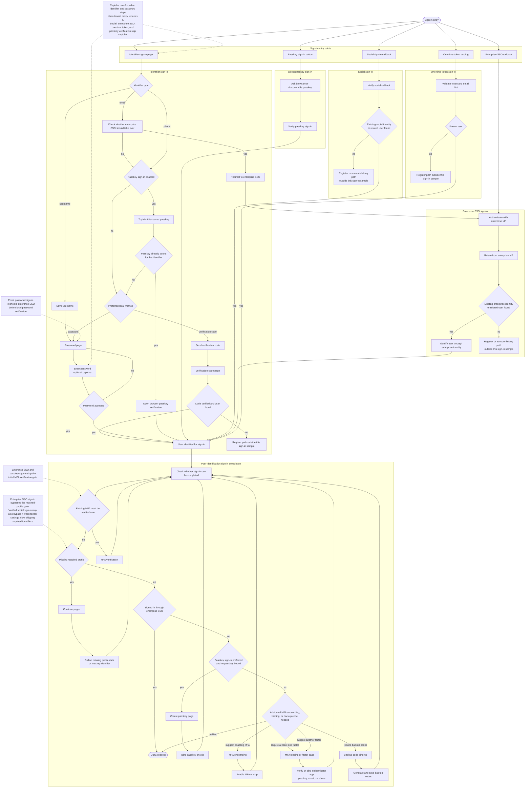

# Sign-in flow sample

```mermaid
flowchart TD
  start([Sign-in entry])

  subgraph EntryPoints["Sign-in entry points"]
    id0[Identifier sign-in page]
    pk0[Passkey sign-in button]
    so0[Social sign-in callback]
    sso0[Enterprise SSO callback]
    ml0[One-time token landing]
  end

  start --> id0
  start --> pk0
  start --> so0
  start --> sso0
  start --> ml0

  subgraph Identifier["Identifier sign-in"]
    id0 --> id1{Identifier type}

    id1 -->|username| idu1[Save username]
    idu1 --> pw0

    id1 -->|email| ide1[Check whether enterprise SSO should take over]
    ide1 -->|yes| sso_redirect[Redirect to enterprise SSO]
    ide1 -->|no| idm1

    id1 -->|phone| idm1{Passkey sign-in enabled}

    idm1 -->|yes| pk_try[Try identifier-based passkey]
    idm1 -->|no| idm2{Preferred local method}

    pk_try --> pk_has{Passkey already bound<br/>for this identifier}
    pk_has -->|yes| pk_verify1[Open browser passkey verification]
    pk_has -->|no| idm2

    idm2 -->|password| pw0[Password page]
    idm2 -->|verification code| vc0[Send verification code]

    vc0 --> vc1[Verification code page]
    vc1 --> vc2{Code verified and user found}
    vc2 -->|yes| identified
    vc2 -->|no| out_vc[Register path outside this sign-in sample]

    pw0 --> pw1[Enter password<br/>optional captcha]
    pw1 --> pw2{Password accepted}
    pw2 -->|yes| identified
    pw2 -->|no| pw0

    pk_verify1 --> identified
  end

  subgraph PasskeyDirect["Direct passkey sign-in"]
    pk0 --> pk1[Ask browser for discoverable passkey]
    pk1 --> pk2[Verify passkey sign-in]
    pk2 --> identified
  end

  subgraph Social["Social sign-in"]
    so0 --> so1[Verify social callback]
    so1 --> so2{Existing social identity<br/>or related user found}
    so2 -->|yes| identified
    so2 -->|no| out_social[Register or account-linking path<br/>outside this sign-in sample]
  end

  subgraph EnterpriseSSO["Enterprise SSO sign-in"]
    sso_redirect --> sso1[Authenticate with enterprise IdP]
    sso0 --> sso1
    sso1 --> sso2[Return from enterprise IdP]
    sso2 --> sso3{Existing enterprise identity<br/>or related user found}
    sso3 -->|yes| identified_sso[Identify user through enterprise identity]
    sso3 -->|no| out_sso[Register or account-linking path<br/>outside this sign-in sample]
  end

  identified_sso --> identified

  subgraph MagicLink["One-time token sign-in"]
    ml0 --> ml1[Validate token and email hint]
    ml1 --> ml2{Known user}
    ml2 -->|yes| identified
    ml2 -->|no| out_ml[Register path outside this sign-in sample]
  end

  note_captcha[Captcha is enforced on identifier and password steps<br/>when tenant policy requires it.<br/>Social, enterprise SSO, one-time token, and passkey verification skip captcha.]
  note_sso_recheck[Email password sign-in rechecks enterprise SSO<br/>before local password verification.]
  note_skip_verify[Enterprise SSO and passkey sign-in skip the initial MFA verification gate.]
  note_profile[Enterprise SSO sign-in bypasses the required-profile gate.<br/>Verified social sign-in may also bypass it when tenant settings allow skipping required identifiers.]

  note_captcha -.-> id0
  note_captcha -.-> pw1
  note_sso_recheck -.-> pw0
  note_skip_verify -.-> mfa_verify_gate
  note_profile -.-> profile_gate

  subgraph AfterIdentify["Post-identification sign-in completion"]
    identified[User identified for sign-in]
    identified --> submit[Check whether sign-in can be completed]

    submit --> mfa_verify_gate{Existing MFA must be verified now}
    mfa_verify_gate -->|yes| mfa_verify[MFA verification]
    mfa_verify_gate -->|no| profile_gate

    mfa_verify --> submit

    profile_gate{Missing required profile}
    profile_gate -->|yes| continue_flow[Continue pages]
    profile_gate -->|no| sso_bypass{Signed in through enterprise SSO}

    continue_flow --> continue_data[Collect missing profile data<br/>or missing identifier]
    continue_data --> submit

    sso_bypass -->|yes| done([OIDC redirect])
    sso_bypass -->|no| passkey_gate{Passkey sign-in preferred<br/>and no passkey bound}

    passkey_gate -->|yes| create_passkey[Create passkey page]
    passkey_gate -->|no| mfa_followup

    create_passkey --> create_passkey2[Bind passkey or skip]
    create_passkey2 --> submit

    mfa_followup{Additional MFA onboarding,<br/>binding, or backup code needed}
    mfa_followup -->|suggest enabling MFA| mfa_on[MFA onboarding]
    mfa_followup -->|require at least one factor| mfa_bind[MFA binding or factor page]
    mfa_followup -->|suggest another factor| mfa_bind
    mfa_followup -->|require backup codes| backup[Backup code binding]
    mfa_followup -->|fulfilled| done([OIDC redirect])

    mfa_on --> mfa_on2[Enable MFA or skip]
    mfa_on2 --> submit

    mfa_bind --> mfa_bind2[Verify or bind authenticator app,<br/>passkey, email, or phone]
    mfa_bind2 --> submit

    backup --> backup2[Generate and save backup codes]
    backup2 --> submit
  end
```
