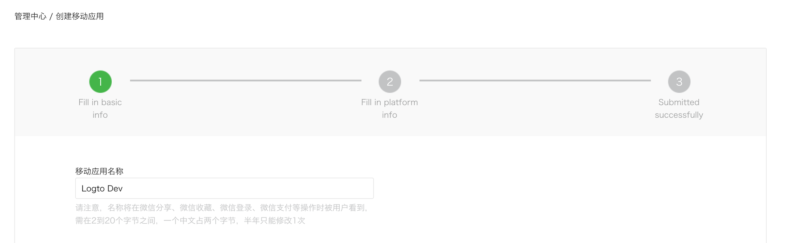
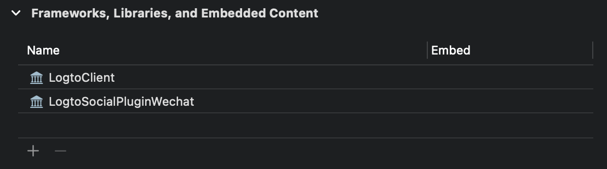

# WeChat native connector

The official Logto connector for WeChat social sign-in in native apps (iOS and Android).

微信原生应用社交登录官方 Logto 连接器（iOS 和 Android）[中文文档](#zh-CN)

## Get started

If you don't know the concept of the connector or haven't add this connector to your Sign-in experience yet, please see [Logto tutorial](https://docs.logto.io/docs/tutorials/get-started/enable-social-sign-in).

In native apps, you cannot use the web as a sign-in method of WeChat. Navigation to WeChat is required, and it also requires using their SDK.

We know it sounds scary, but don't worry. We'll handle it easily in this tutorial.

## Create a mobile app in the WeChat Open Platform

:::tip
You can skip some sections if you already did.
:::

### Create an account

Open https://open.weixin.qq.com/, click the "Sign Up" button in the upper-right corner, then finish the sign-up process.

### Create a mobile app

Sign in with the account you just created. In the "Mobile Application" (移动应用) tab, click the big green button "Create a mobile app" (创建移动应用).


Let's fill out the required info in the application form. 



### Basic info

Most of them are pretty straightforward, and we have several tips here:

- If you just want to test WeChat sign-in and the app is not on the App Store, in the "App is available" section, choose "No" to skip the "App download link".
- The "App operation flow chart" looks tricky. From our experience, you need to prepare a simple flowchart and several app screenshots to improve the possibility of passing the review.

Click "Next step" to move on.

### Platform info

Check "iOS app" (iOS 应用), then check the target device type of your app accordingly.


If you chose "No" for the App Store availability, you cloud skip filling out "AppStore download address" here.

Fill out _Bundle ID_, _Test version Bundle ID_, and _Universal Links_ (actually, only one link is needed 😂).

:::note
_Bundle ID_ and _Test version Bundle ID_ can be the same value.
:::

:::tip
WeChat requires Universal Link for native sign-in. If you haven't set up or don't know it, please refer to the [Apple official doc](https://developer.apple.com/ios/universal-links/).
:::

Click "Submit Review" to continue.

### Waiting for the review result

Usually, the review goes fast, which will end within 1-2 days.

We suspect the reviewer is allocated randomly on each submission, and the standard is floating. You may get rejected the first time, but don't give up! State your status quo and ask the reviewer how to modify it.

## Compose the connector JSON

After passing the review, go to the application details page and generate an AppSecret. Compose the connector JSON with the following format:

```json
{
  "appId": "wx123456789",
  "appSecret": "some-random-string",
  "universalLink": "https://your.domain/path/" // The universal link to your app
}
```

## Add the Logto social plugin to your app

We assume you have integrated [Logto iOS SDK](https://docs.logto.io/docs/recipes/integrate-logto/ios) in your app. In this case, things are pretty simple, and you don't even need to read the WeChat SDK doc:

**1. Add `LogtoSocialPluginWechat` to your Xcode project**

Add the framework:



And add `-ObjC` to your build settings:

**2. Add the plugin to your `LogtoClient` init options**

```swift
let logtoClient = LogtoClient(
  useConfig: config,
  socialPlugins: [LogtoSocialPluginWechat()]
)
```

**3. Handle `onOpenURL` properly**

```swift
// SwiftUI
YourRootView()
  .onOpenURL { url in
      LogtoClient.handle(url: url)
  }

// or AppDelegate
func application(_ app: UIApplication, open url: URL, options: /*...*/) -> Bool {
  LogtoClient.handle(url: url)
}
```

That's it. Don't forget to [Enable connector in sign-in experience](https://docs.logto.io/docs/tutorials/get-started/enable-social-sign-in#enable-connector-in-sign-in-experience).

After WeChat native connector is enabled, you can build and run your app to see if it works.

:::tip
WeChat doesn't have a plan for those devices without the WeChat app installed. Logto will hide this connector during sign-in if so (which is the recommended way from the [official development guide](https://developers.weixin.qq.com/doc/oplatform/en/Mobile_App/WeChat_Login/Development_Guide.html)).
:::

# 微信原生连接器 {#zh-CN}

TBD
