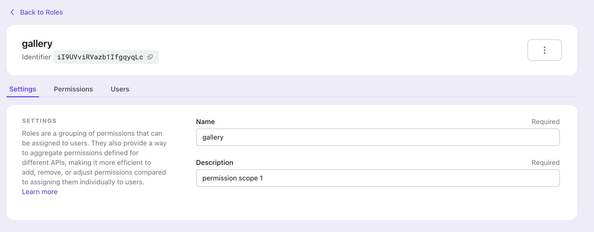
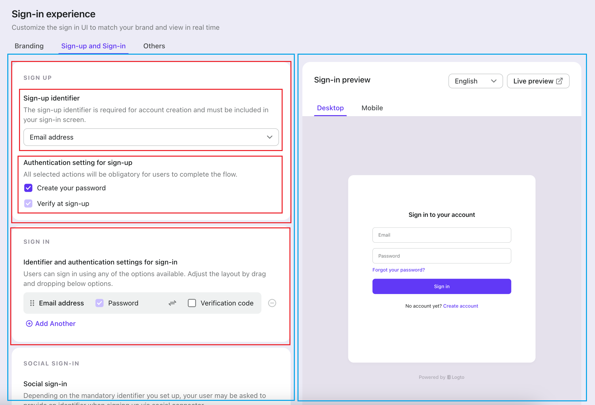
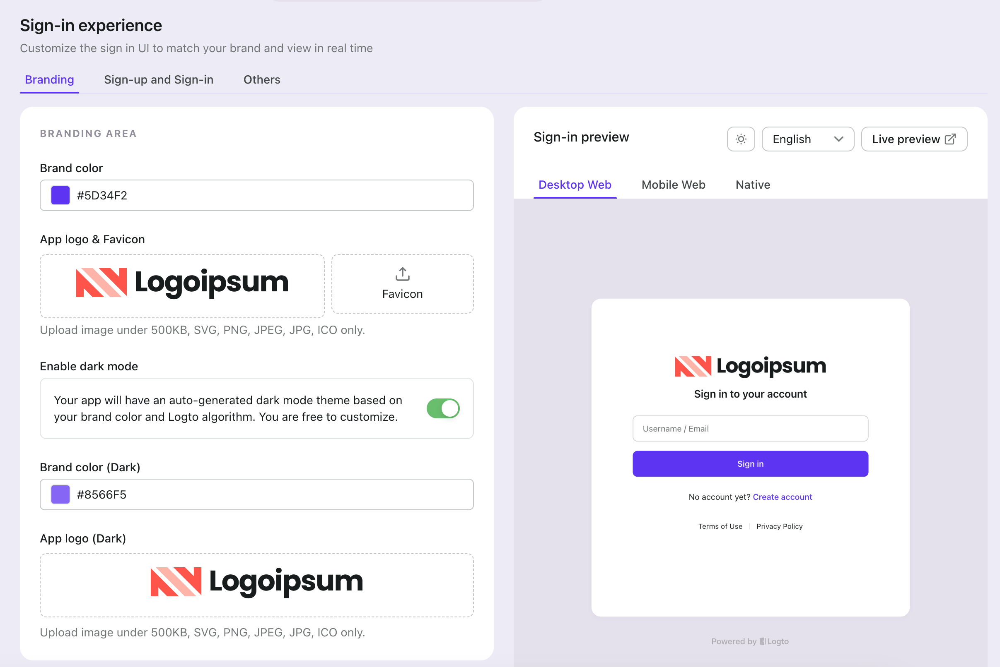

# Console Convention

Applies to `packages/console`.

## Reserved Folder

| Folder | Usage | Notes |
| --- | --- | --- |
| `/src/containers` | App-level layouts or containers |  |
| `/src/contexts` | App-level contexts |  |
| `/src/hooks` | Hooks used in the app |  |
| `/src/ds-components` | Standard components | The [design system](https://www.figma.com/file/bcSRcMyKEQc0c7k7QfP9fG/%F0%9F%A7%B1%5BComponent%5D-AC-Web?type=design&node-id=0-1&t=pbjePMSIt4syxAry-0) has defined standard components |
| `/src/components` | Reused patterns in the app | Mainly related to business |
| `/src/mdx-components` | Reused patterns for mdx only |  |
| `/src/pages` | Console pages |  |
| `/src/cloud` | The root of the cloud app, should follow the conventions below |  |
| `/src/assets/images` | The folder for illustrations |  |
| `/src/assets/icons` | The folder for icons |  |

## Page Development

### Flatten sub-pages in the root page folder

Assume that you have a page with multiple tabs, you need to place the tab pages under the page’s root folder.



The related code structure is:

```txt
- pages
  - RoleDetails
    - index.modules.scss
    - index.tsx
    - RoleSettings
      - index.module.scss
      - index.tsx
    - RolePermissions
      - index.module.scss
      - index.tsx
    - RoleUsers
      - index.tsx
```

If you only need a single tsx for the sub-page, the sub-page folder is no need.

```txt
- pages
  - RoleDetails
    - index.module.scss
    - index.tsx
    - RoleSettings.tsx
    - RolePermissions.tsx
    - RoleUsers.tsx
```

If the page folder also have other code files, you can reorg them by adding some specific folders:

```txt
- pages
  - RoleDetails
  - index.module.scss
  - index.tsx
  - tabs
    - RoleSettings
    - RolePermissions
    - RoleUsers
  - hooks
    - use-role-data.ts
    - use-user-role.ts
  - utils
    - parser.ts
    - formater.ts
```

### Components only shared in a page should be in the page root folder



In this page, we have a `TabWrapper` shared among these tabs:

```txt
- pages
  - SignInExperience
    - components
      - TabWrapper.tsx
    - tabs
      - Branding
      - SignUpAndSignIn
      - Others
    - index.module.scss
    - index.tsx
```

### Flatten components of a page in the related page folder

Since a page may be complex, so some times we will divide the page into several parts.



```txt
- SignInExperience
  - index.module.scss
  - index.tsx
  - SignInPreview
    - index.tsx
    - index.module.scss
  - tabs
    - Branding
    - Others
    - SignUpAndSignIn
      - SignUpForm
        - SignUpIdentifer.tsx
        - AuthenticationSettings.tsx
        - index.module.scss
        - index.tsx
      - SignInForm
        - index.module.scss
        - index.tsx
```

Please note the hierarchical relationships between the following items and folders:

- `tabs`, `SignInPreview` correspond to folder `SignInExperience`
- `SignUpForm`, `SignInForm` correspond to folder `SignUpAndSignIn`
- `SignUpIdentifier`, `AuthenticationSettings` correspond to folder `SignUpForm`

### Use folder if a sub-page or page componet have more then one file

Bad:

```txt
- SignUpForm
  - SignUpIdentifer.module.scss
  - SignUpIdentifer.tsx
  - index.tsx
```

Good:

```txt
- SignUpForm
  - SignUpIdentifer
    - index.module.scss
    - index.tsx
  - index.tsx
```

### Hooks / Context

When you write a specific hook, you can place it in the closest relevant code directory to where it will be used (usually in rare cases). If this hook will be used throughout the entire app, it should be placed in **`/src/hooks`**. The same applies to context, except that app-level context should be located in **`/src/context`**.

## React Hook Form Data Handling

### Always render the React Hook Form data after the remote data is fetched

When rendering a React Hook Form based on remote data, ensure that the remote data is loaded before proceeding to use the **`useForm`** method of React Hook Form.

Set the default values of the form fields to the data fetched from the remote source. Otherwise, before fetching remote data, the values of form fields registered within React Hook Form will be **`undefined`**, even though they are marked as required.

For example, if there is a **`FormData`** type:

```tsx
type FormData = {
  config: {
    url: string;
    headers: Record<string, string>;
  };
};
```

The **`config`** property is expected to exist in the data fetched from the backend. However, using **`const formMethod = useForm<FormData>()`** before fetching the data cannot guarantee the existence of **`config`** within the form context. Thus, sometimes calling **`formMethod.watch('config')`** may return **`undefined`**.

The correct approach is to ensure that the remote data is fetched before setting it as the form's default value.

```tsx
const FormWrapper = (data: FormData) => {
  const formMethod = useForm<FormData>({ defaultValues: data });
  //... other codes
};
```

### Convert nullable data field into its empty value before setting it as the default form value

In our backend implementation for updating data, when a nullabel field's value is an empty string `''`, it will be converted to `null` when stored in the database. Consequently, when fetching this data again in the frontend, the field becomes `null`.

In React Hook Form, if a field's value is `null` and it's registered with an `input` component, when we focus on this component, the corresponding field value in the form context changes from `null` to an empty string `''`.

While this doesn't reflect a change in the actual data, it does make the form context data dirty. This can lead to inaccurate form states, such as the appearance of a save button.

Therefore, if the backend returns nullable fields, they need to be converted to corresponding empty values before setting them as default values in the form:

```tsx
type Data = {
  name: string;
  description: string | null;
};

type FormData = {
  name: string;
  description: string;
};

const convertToFormData = (data: Data): FormData => {
  const { description } = data;
  return {
    ...data,
    description: description ?? '', // Convert to string's empty value
  };
};

// ...in a component
const formMethod = useForm<FormData>({ defaultValues: convertToFormData(data) });
```
