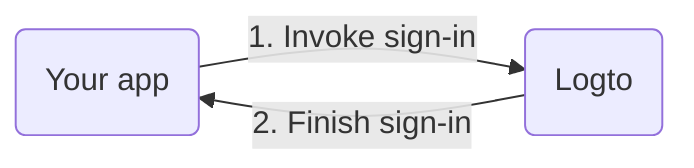

import RegardingRedirectBasedSignIn from './_regarding-redirect-based-sign-in.md';

Before we dive into the details, here's a quick overview of the end-user experience. The sign-in process can be simplified as follows:

1. Your app invokes the sign-in method.
2. The user is redirected to the Logto sign-in page. For native apps, the system browser is opened.
3. The user signs in and is redirected back to your app (configured as the redirect URI).

<RegardingRedirectBasedSignIn />

---
