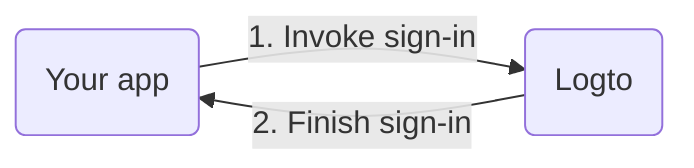

import InlineNotification from '@/ds-components/InlineNotification';
import UriInputField from '@/mdx-components/UriInputField';

Before we dive into the details, here's a quick overview of the end-user experience. The sign-in process can be simplified as follows:

1. Your app invokes the sign-in method.
2. The user is redirected to the Logto sign-in page. For native apps, the system browser is opened.
3. The user signs in and is redirected back to your app (configured as the redirect URI).

Regarding redirect-based sign-in:

1. This authentication process follows the [OpenID Connect (OIDC)](https://openid.net/specs/openid-connect-core-1_0.html) protocol, and Logto enforces strict security measures to protect user sign-in.
2. If you have multiple apps, you can use the same identity provider (Logto). Once the user signs in to one app, Logto will automatically complete the sign-in process when the user accesses another app.

To learn more about the rationale and benefits of redirect-based sign-in, see [Logto sign-in experience explained](https://docs.logto.io/docs/tutorials/get-started/sign-in-experience).

---

<InlineNotification>
  In the following steps, we assume your app is running on <code>http://localhost:3000</code>.
</InlineNotification>

Now, let's enter your redirect URI. E.g. {`${props.callbackUri ?? 'http://localhost:3000/callback'}`}.

<UriInputField name="redirectUris" />

Just like signing in, users should be redirected to Logto for signing out of the shared session. Once finished, it would be great to redirect the user back to your website. For example, add `http://localhost:3000` as the post sign-out redirect URI below.

<UriInputField name="postLogoutRedirectUris" />
