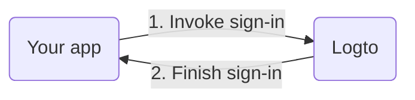

Before we dive into the details, here's a quick overview of the end-user experience. The sign-in process can be simplified as follows:

1. Your app invokes the sign-in method.
2. The user is redirected to the Logto sign-in page. For native apps, the system browser is opened.
3. The user signs in and is redirected back to your app (configured as the redirect URI).

Regarding redirect-based sign-in:

1. This authentication process follows the [OpenID Connect (OIDC)](https://openid.net/specs/openid-connect-core-1_0.html) protocol, and Logto enforces the Authorization Code Flow with PKCE to ensure the security of the authentication process.
2. If you have multiple apps, you can use the same authentication server (Logto), and the user only needs to sign in once.

To learn more about the rationale and benefits of redirect-based sign-in, see [Logto sign-in experience explained](https://docs.logto.io/docs/tutorials/get-started/sign-in-experience).

---
