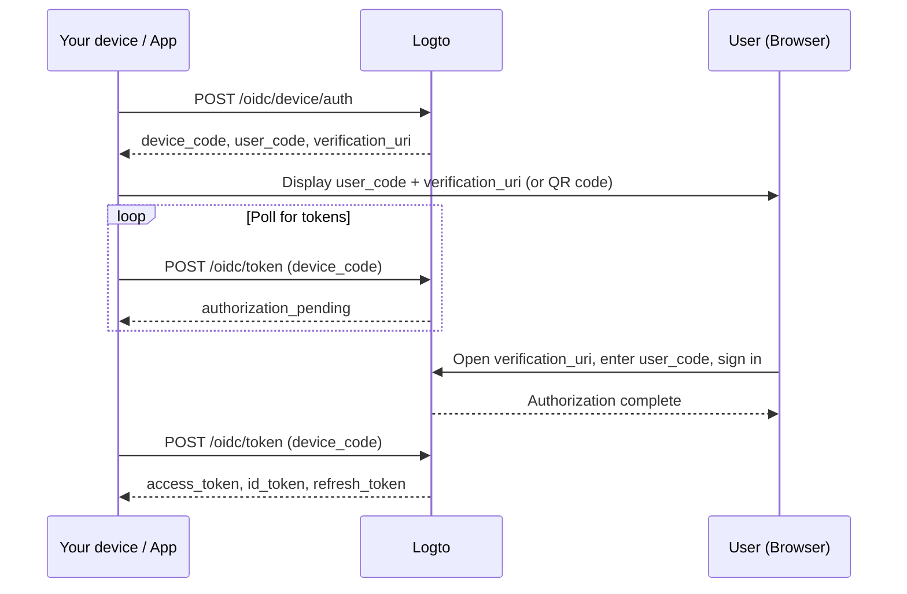

import InlineNotification from '@/ds-components/InlineNotification';
import Steps from '@/mdx-components/Steps';
import Step from '@/mdx-components/Step';
import CustomDomainEndpointNotice from '@/mdx-components/CustomDomainEndpointNotice';

<Steps>

<Step
  title="Understand the device flow"
  subtitle="How it works"
>

The [OAuth 2.0 device authorization grant](https://datatracker.ietf.org/doc/html/rfc8628) (device flow) is designed for devices with limited input capabilities (e.g., smart TVs, CLI tools, IoT devices). The device displays a code and a URL, while the user completes authentication on a separate device such as a phone or laptop.

</Step>

<Step
  title="Request a device code"
  subtitle="Initiate the device authorization"
>

Send a `POST` request to the device authorization endpoint:

<Code className="language-bash">
{`curl --request POST '${new URL('/oidc/device/auth', props.endpoint).href}' \\
  --header 'Content-Type: application/x-www-form-urlencoded' \\
  --data-urlencode 'client_id=${props.app.id}' \\
  --data-urlencode 'scope=openid offline_access profile'`}
</Code>

The response includes:

| Field | Description |
|-------|-------------|
| `device_code` | A unique code your app uses when polling the token endpoint. |
| `user_code` | A short code to display to the user for them to enter in the browser. |
| `verification_uri` | The URL where the user enters the `user_code`. |
| `verification_uri_complete` | A URL with the `user_code` pre-filled, ideal for generating a QR code. |
| `expires_in` | The lifetime in seconds of `device_code` and `user_code`. Stop polling after this. |

Your app should wait at least **5 seconds** between polling requests.

<CustomDomainEndpointNotice />

</Step>

<Step
  title="Display the verification URL to the user"
  subtitle="Let the user complete authentication in a browser"
>

Show the `user_code` and `verification_uri` on your device screen. You can also generate a QR code
from `verification_uri_complete` so the user can scan it and skip manual code entry.

</Step>

<Step
  title="Poll for tokens"
  subtitle="Exchange the approved device code for tokens"
>

While the user completes authentication in the browser, your app should poll the token endpoint at
least every 5 seconds:

<Code className="language-bash">
{`curl --request POST '${new URL('/oidc/token', props.endpoint).href}' \\
  --header 'Content-Type: application/x-www-form-urlencoded' \\
  --data-urlencode 'client_id=${props.app.id}' \\
  --data-urlencode 'grant_type=urn:ietf:params:oauth:grant-type:device_code' \\
  --data-urlencode 'device_code=DEVICE_CODE'`}
</Code>

Replace `DEVICE_CODE` with the `device_code` value from the device authorization response in the previous step.

Before the user completes verification, the endpoint returns one of these errors:

- `authorization_pending` — The user hasn't completed authorization yet. Wait at least 5 seconds and try again.

Stop polling when:

- You receive a successful token response.
- The `expires_in` time from the device code response has elapsed.
- You receive a non-retryable error such as `expired_token` or `access_denied`.

After the user approves, the response includes:

| Field | Description |
|-------|-------------|
| `access_token` | The access token for API calls. This is an opaque string by default; when a `resource` is requested, it is a JWT with the `aud` claim set to the resource URI. |
| `id_token` | The ID token containing user identity claims. Only present when `openid` scope is requested. |
| `refresh_token` | Used to obtain new tokens without re-authentication. Only present when `offline_access` scope is requested. |
| `token_type` | Always `Bearer`. |
| `expires_in` | Token lifetime in seconds. |
| `scope` | The scopes granted by the authorization server. |

</Step>

<Step
  title="Refresh tokens"
  subtitle="Obtain new access tokens using the refresh token"
>

When the access token expires, use the `refresh_token` to obtain a new one without requiring the
user to re-authenticate:

<Code className="language-bash">
{`curl --request POST '${new URL('/oidc/token', props.endpoint).href}' \\
  --header 'Content-Type: application/x-www-form-urlencoded' \\
  --data-urlencode 'client_id=${props.app.id}' \\
  --data-urlencode 'grant_type=refresh_token' \\
  --data-urlencode 'refresh_token=REFRESH_TOKEN'`}
</Code>

The response has the same structure as the initial token response: it includes a new `access_token`,
`token_type`, `expires_in`, `scope`, and potentially a new `id_token`. A new `refresh_token` is also
issued (token rotation), so always store and use the latest `refresh_token` for subsequent requests.

#### Get an access token for a specific API resource

If your device authorization request included a `resource` parameter, you can obtain a JWT access
token scoped to that API resource by passing the `resource` parameter during the refresh:

<Code className="language-bash">
{`curl --request POST '${new URL('/oidc/token', props.endpoint).href}' \\
  --header 'Content-Type: application/x-www-form-urlencoded' \\
  --data-urlencode 'client_id=${props.app.id}' \\
  --data-urlencode 'grant_type=refresh_token' \\
  --data-urlencode 'refresh_token=REFRESH_TOKEN' \\
  --data-urlencode 'resource=YOUR_API_RESOURCE_INDICATOR'`}
</Code>

Replace `YOUR_API_RESOURCE_INDICATOR` with the API resource indicator (URI) you created in Logto.

Without the `resource` parameter, the refresh response returns an opaque access token. With the
`resource` parameter, it returns a JWT access token with `aud` set to the specified resource URI.

<InlineNotification>
  The <code>refresh_token</code> is only available when the <code>offline_access</code> scope is
  included in the initial device authorization request.
</InlineNotification>

</Step>

<Step title="Checkpoint: Test your device flow">

Now, test your device flow integration:

1. Run your app and trigger the device flow to get a `device_code` and `user_code`.
2. Open the `verification_uri` in a browser and enter the `user_code` (or scan the QR code for `verification_uri_complete`).
3. Complete the sign-in process in the browser.
4. Verify that your app receives tokens after polling.
5. Use the `refresh_token` to obtain a new access token.

</Step>

</Steps>
