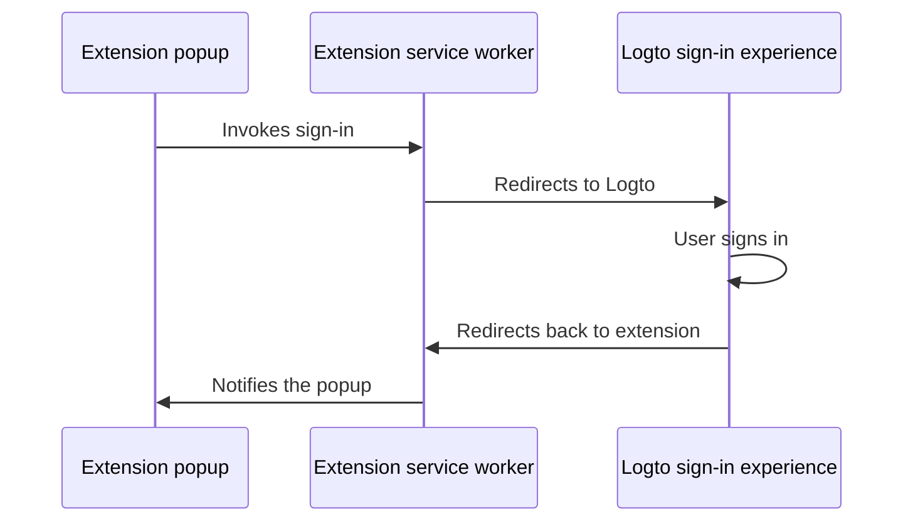

import UriInputField from '@/mdx-components/UriInputField';
import InlineNotification from '@/ds-components/InlineNotification';
import Steps from '@/mdx-components/Steps';
import Step from '@/mdx-components/Step';
import NpmLikeInstallation from '@/mdx-components/NpmLikeInstallation';

import RegardingRedirectBasedSignIn from '../../fragments/_regarding-redirect-based-sign-in.md';

import extensionPopup from './extension-popup.webp';

<Steps>

<Step
  title="Installation"
  subtitle="Install Logto SDK for your project"
>

<NpmLikeInstallation packageName="@logto/chrome-extension" />

</Step>

<Step title="Understand the authentication flow">

Assuming you put a "Sign in" button in your Chrome extension's popup, the authentication flow will look like this:



For other interactive pages in your extension, you just need to replace the `Extension popup` participant with the page's name. In this tutorial, we will focus on the popup page.

<RegardingRedirectBasedSignIn />

</Step>

<Step title="Configure your extension">

### Update the `manifest.json`

Logto SDK requires the following permissions in the `manifest.json`:

```json title="manifest.json"
{
  "permissions": ["identity", "storage"],
  "host_permissions": ["https://*.logto.app/*"]
}
```

- `permissions.identity`: Required for the Chrome Identity API, which is used to sign in and sign out.
- `permissions.storage`: Required for storing the user's session.
- `host_permissions`: Required for the Logto SDK to communicate with the Logto APIs.

<InlineNotification>
If you are using a custom domain on Logto Cloud, you need to update the `host_permissions` to match your domain.
</InlineNotification>

### Set up a background script (service worker)

In your Chrome extension's background script, initialize the Logto SDK:

```js title="service-worker.js"
import LogtoClient from '@logto/chrome-extension';

export const logtoClient = new LogtoClient({
  endpoint: '<your-logto-endpoint>'
  appId: '<your-logto-app-id>',
});
```

Replace `<your-logto-endpoint>` and `<your-logto-app-id>` with the actual values. You can find these values in the application page you just created in the Logto Console.

If you don't have a background script, you can follow the [official guide](https://developer.chrome.com/docs/extensions/develop/concepts/service-workers/basics) to create one.

<InlineNotification>
**Why do we need a background script?**

Normal extension pages like the popup or options page can't run in the background, and they have the possibility to be closed during the authentication process. A background script ensures the authentication process can be properly handled.
</InlineNotification>

Then, we need to listen to the message from other extension pages and handle the authentication process:

```js title="service-worker.js"
chrome.runtime.onMessage.addListener((message, sender, sendResponse) => {
  // In the below code, since we return `true` for each action, we need to call `sendResponse`
  // to notify the sender. You can also handle errors here, or use other ways to notify the sender.

  if (message.action === 'signIn') {
    const redirectUri = chrome.identity.getRedirectURL('/callback');
    logtoClient.signIn(redirectUri).finally(sendResponse);
    return true;
  }

  if (message.action === 'signOut') {
    const redirectUri = chrome.identity.getRedirectURL();
    logtoClient.signOut(redirectUri).finally(sendResponse);
    return true;
  }

  return false;
});
```

You may notice there are two redirect URIs used in the code above. They are both created by `chrome.identity.getRedirectURL`, which is a [built-in Chrome API](https://developer.chrome.com/docs/extensions/reference/api/identity#method-getRedirectURL) to generate a redirect URL for auth flows. The two URIs will be:

- `https://<extension-id>.chromiumapp.org/callback` for sign-in.
- `https://<extension-id>.chromiumapp.org/` for sign-out.

Note that these URIs are not accessible, and they are only used for Chrome to trigger specific actions for the authentication process.

</Step>

<Step title="Update Logto application settings">

As we mentioned in the previous step, we need to update the Logto application settings to allow the redirect URIs we just created (`https://<extension-id>.chromiumapp.org/callback`):

<UriInputField name="redirectUris" />

And the post sign-out redirect URI (`https://<extension-id>.chromiumapp.org/`):

<UriInputField name="postLogoutRedirectUris" />

Finally, the CORS allowed origins should include the extension's origin (`chrome-extension://<extension-id>`). The SDK in Chrome extension will use this origin to communicate with the Logto APIs.

<UriInputField type="customClientMetadata" name="corsAllowedOrigins" />

Don't forget to replace `<extension-id>` with your actual extension ID and click the "Save" button.

</Step>

<Step title="Add sign-in and sign-out buttons">

We're almost there! Let's add the sign-in and sign-out buttons and other necessary logic to the popup page.

In the `popup.html` file:

```html title="popup.html"
<button id="sign-in">Sign in</button> <button id="sign-out">Sign out</button>
```

In the `popup.js` file (assuming `popup.js` is included in the `popup.html`):

```js title="popup.js"
document.getElementById('sign-in').addEventListener('click', async () => {
  await chrome.runtime.sendMessage({ action: 'signIn' });
  // Sign-in completed (or failed), you can update the UI here.
});

document.getElementById('sign-out').addEventListener('click', async () => {
  await chrome.runtime.sendMessage({ action: 'signOut' });
  // Sign-out completed (or failed), you can update the UI here.
});
```

</Step>

<Step title="Checkpoint: Test the authentication flow">

Now you can test the authentication flow in your Chrome extension:

1. Open the extension popup.
2. Click on the "Sign in" button.
3. You will be redirected to the Logto sign-in page.
4. Sign in with your Logto account.
5. You will be redirected back to the Chrome.

</Step>

<Step title="Check authentication state">

Since Chrome provide unified storage APIs, rather than the sign-in and sign-out flow, all other Logto SDK methods can be used in the popup page directly.

In your `popup.js`, you can reuse the `LogtoClient` instance created in the background script, or create a new one with the same configuration:

```js title="popup.js"
import LogtoClient from '@logto/chrome-extension';

const logtoClient = new LogtoClient({
  endpoint: '<your-logto-endpoint>'
  appId: '<your-logto-app-id>',
});

// Or reuse the logtoClient instance created in the background script
import { logtoClient } from './service-worker.js';
```

Then you can create a function to load the authentication state and user's profile:

```js title="popup.js"
const loadAuthenticationState = async () => {
  const isAuthenticated = await logtoClient.isAuthenticated();
  // Update the UI based on the authentication state

  if (isAuthenticated) {
    const user = await logtoClient.getIdTokenClaims(); // { sub: '...', email: '...', ... }
    // Update the UI with the user's profile
  }
};
```

You can also combine the `loadAuthenticationState` function with the sign-in and sign-out logic:

```js title="popup.js"
document.getElementById('sign-in').addEventListener('click', async () => {
  await chrome.runtime.sendMessage({ action: 'signIn' });
  await loadAuthenticationState();
});

document.getElementById('sign-out').addEventListener('click', async () => {
  await chrome.runtime.sendMessage({ action: 'signOut' });
  await loadAuthenticationState();
});
```

Here's an example of the popup page with the authentication state:


</Step>

<Step title="Other considerations">

- **Service worker bundling**: If you use a bundler like Webpack or Rollup, you need to explicitly set the target to `browser` or similar to avoid unnecessary bundling of Node.js modules.
- **Module resolution**: Logto Chrome extension SDK is an ESM-only module.

See our [sample project](https://github.com/logto-io/js/tree/HEAD/packages/chrome-extension-sample) for a complete example with TypeScript, Rollup, and other configurations.

</Step>

</Steps>
