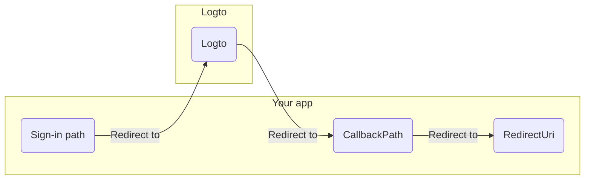

import RegardingRedirectBasedSignIn from '../../../fragments/_regarding-redirect-based-sign-in.md';

Before we proceed, there are two confusing terms in the .NET Core authentication middleware that we need to clarify:

1. **CallbackPath**: The URI that Logto will redirect the user back to after the user has signed in (the "redirect URI" in Logto)
2. **RedirectUri**: The URI that will be redirected to after necessary actions have been taken in the Logto authentication middleware.

The sign-in process can be illustrated as follows:

 

Similarly, .NET Core also has **SignedOutCallbackPath** and **RedirectUri** for the sign-out flow.

For the sack of clarity, we'll refer them as follows:

| Term we use                      | .NET Core term        |
| -------------------------------- | --------------------- |
| Logto redirect URI               | CallbackPath          |
| Logto post sign-out redirect URI | SignedOutCallbackPath |
| Application redirect URI         | RedirectUri           |

<RegardingRedirectBasedSignIn />
