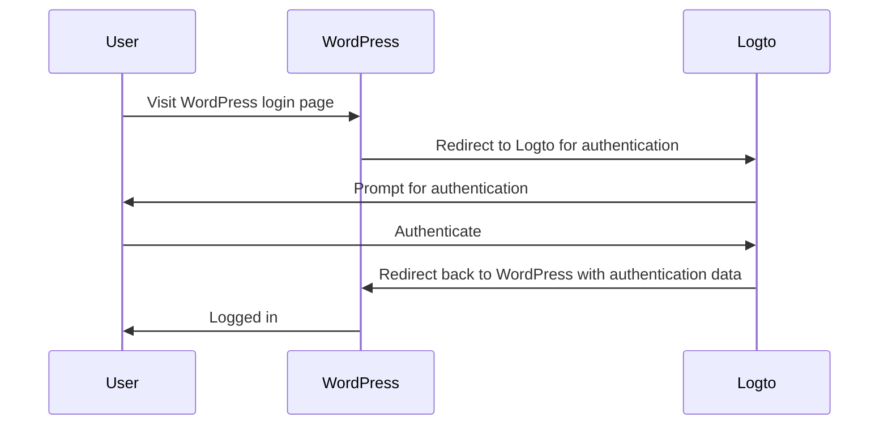
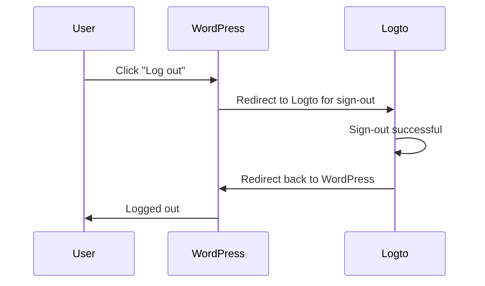

import UriInputField from '@/mdx-components/UriInputField';
import Tabs from '@/mdx-components/Tabs';
import TabItem from '@/mdx-components/TabItem';
import InlineNotification from '@/ds-components/InlineNotification';
import Steps from '@/mdx-components/Steps';
import Step from '@/mdx-components/Step';
import CustomDomainEndpointNotice from '@/mdx-components/CustomDomainEndpointNotice';

<Steps>

<Step title="Get started">

This tutorial will show you how to integrate Logto into your [Wordpress](https://wordpress.org) website.

Follow the official [Wordpress installation guide](https://wordpress.org/support/article/how-to-install-wordpress/) to set up your Wordpress website before proceeding.

</Step>

<Step title="Install the plugin">

<Tabs>

<TabItem value="admin-panel" label="From WordPress admin panel">

1. Go to **Plugins** > **Add New**.
2. Search for "Logto", or enter `https://wordpress.org/plugins/logto/` in the search box.
3. Click **Install Now**.
4. Click **Activate**.

</TabItem>

<TabItem value="upload" label="From upload">

1. Download the Logto WordPress plugin from one of the following links:
   - [Latest release](https://github.com/logto-io/wordpress/releases): Download the file which name in the format of `logto-plugin-<version>.zip`.
   - [WordPress plugin directory](https://wordpress.org/plugins/logto/): Download the file by clicking the **Download** button.
2. Download the plugin ZIP file.
3. Go to **Plugins** > **Add New** in your WordPress admin panel.
4. Click **Upload Plugin**.
5. Select the downloaded ZIP file and click **Install Now**.
6. Click **Activate**.

</TabItem>

</Tabs>

</Step>

<Step title="Configure the plugin">

Now you should be able to see the Logto menu in your WordPress admin panel sidebar. Click **Logto** > **Settings** to configure the plugin.

The minimum configuration to get started for the plugin is:

- Logto endpoint: <code>{props.endpoint}</code>
- App ID: <code>{props.app.id}</code>
- App secret: <code>{props.secrets[0]?.value ?? props.app.secret}</code>

After filling in the values, click **Save Changes** (scroll down to the bottom of the page if you can't find the button).

 

<CustomDomainEndpointNotice />

</Step>

<Step title="Configure redirect URI">

The redirect URI is the URL to which Logto will redirect users after they have authenticated; and the post sign-out redirect URI is the URL to which Logto will redirect users after they have logged out.

Here's a non-normative sequence diagram to illustrate the sign-in flow:

Here's how the sign-out flow looks like in a non-normative sequence diagram:

To learn more about why redirect is needed, see [Sign-in experience explained](/concepts/sign-in-experience).

In our case, we need to configure both redirect URIs in your Logto Console.

To find the redirect URI, go to the **Logto** > **Settings** page in your WordPress admin panel. You'll see the **Redirect URI** and **Post sign-out redirect URI** fields.

Now, copy the **Redirect URI** and fill it into the **Redirect URIs** field:

<UriInputField name="redirectUris" />

Copy the **Post sign-out redirect URI** and fill it into the **Post sign-out redirect URIs** field:

<UriInputField name="postLogoutRedirectUris" />

Remember to click **Save**.

</Step>

<Step title="Checkpoint: Test your WordPress website">

Now you can test your Logto integration in your WordPress website:

1. Open an incognito browser window if needed.
2. Visit your WordPress website and click the **Log in** link if applicable; or directly visit the login page (e.g., `https://example.com/wp-login.php`).
3. The page should redirect you to the Logto sign-in page.
4. Complete the sign-in or sign-up process.
5. After successful authentication, you should be redirected back to your WordPress website and logged in automatically.
6. Click the **Log out** link to log out of your WordPress website.
7. You should be redirected to the Logto sign-out page, then back to your WordPress website.
8. You should be logged out of your WordPress website.

</Step>

</Steps>
